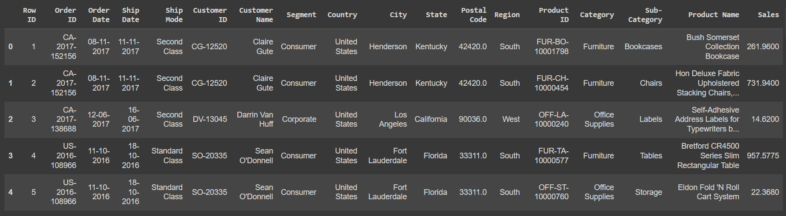
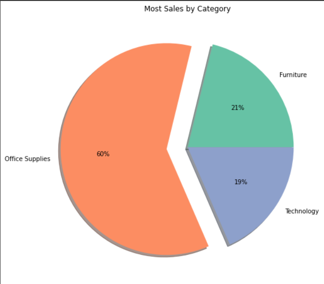

# Ex03-Univariate-Analysis

# AIM
To read the given dataset and perform univariate analysis

# Explanation
This is simplest form of data analysis, where the data being analyzed consists of just one variable. Since it’s a single variable, it doesn’t deal with causes or relationships. The main purpose of univariate analysis is to describe the data and find patterns that exist within it.
In a dataset, it explores each variable separately. It is possible for two kinds of variables- Categorical and Numerical.


# ALGORITHM
## STEP 1
Read the given Data

## STEP 2
Get the information about the data

## STEP 3
Preprocess the data

## STEP 4
Fill null values in PINCODE column using mode() method

## STEP 5
Analyse the data using both statistical and graphical method

# CODE
```
Developed by: Vineesh M
Reg No: 212221230122
```

```
import pandas as pd
import numpy as np
import seaborn as sns
import matplotlib.pyplot as plt

df = pd.read_csv("C:\Users\vinee\data science\Ex03-Univariate-Analysis\SuperStore.csv")
df

df.head()

df.info()

df.describe()

df.tail()

df.shape

df.columns

df.isnull().sum()

df.duplicated()

df['Postal Code'] = df['Postal Code'].fillna(df['Postal Code'].mode()[0])

df.isnull().sum()

df_count = df.groupby(by=["Category"]).count()
labels=[]
for i in df_count.index:
    labels.append(i)
plt.figure(figsize=(8,8))
colors = sns.color_palette("Set2")
myexplode = [0, 0.2,0]
plt.pie(df_count["Sales"], colors = colors,explode = myexplode, labels=labels, autopct = "%0.0f%%",shadow = True) 
plt.title("Most Sales by Category")
plt.show()

df_region = df.groupby(by=["Region"]).count()
labels = []
for i in df_region.index:
    labels.append(i)
plt.figure(figsize=(8,8))
colors = sns.color_palette('pastel')
myexplode = [0, 0,0,0.2]
plt.pie(df_region["Sales"], colors = colors,explode = myexplode, labels=labels, autopct = "%0.0f%%",shadow = True)
plt.title("Most Sales by Region")
plt.show()

df['City'].value_counts()

df['Order Date'].value_counts()

df_segment = df.groupby(by=["Segment"]).sum()
labels = []
for i in df_segment.index:
    labels.append(i)

plt.figure(figsize=(8,8))
colors = sns.color_palette('pastel')
myexplode = [0.2, 0,0]
pie = plt.pie(df_segment["Sales"], colors = colors,explode = myexplode, autopct = "%0.0f%%",shadow = True)
plt.title("Most Revenue Generated based on Segment")
plt.legend(pie[0], labels, loc="upper corner")
plt.show()
```
# OUTPUT
## Dataset

## Dataset Head

## Dataset Info

## Dataset Describe

## Dataset Tail

## Dataset Shape

## Dataset Columns

## Null Values - Pre Cleaning

## Dataset Duplicated

## Null Values - Post Cleaning

## Univariate Analysis - Category

## Univariate Analysis - Region

## Univariate Analysis - City

## Univariate Analysis - Order Date

## Univariate Analysis - Segment


# RESULT
The given dataset is read and univariate analysis is performed. The inferences are:
1. Most sales were from "Office Supplies" category 
2. Most sales were from "West" Region
3. Most sales were from "New York City"
4. On "September 5th 2017" most sales took place - A total of 38
5. Most Revenue is generated from the "Consumer" segment.